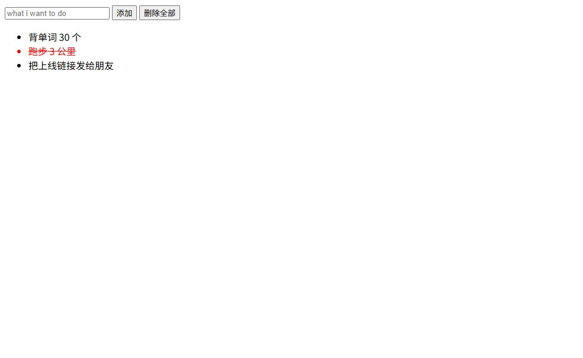

# 待办清单

一个用 HTML、CSS 和 JavaScript 做的待办清单网站——我学前端第一个月的作品。

**在线使用：** https://cs2007soren.github.io/todo-app/

## 功能

- 添加待办
- 单击一条 → 划线表示已完成（再点一下取消）
- 双击一条 → 删除这一条
- 「删除全部」按钮 → 一键清空
- 刷新页面不丢失

## 技术栈

HTML + CSS + 原生 JavaScript，无框架、无依赖；数据存在浏览器的 localStorage 里，所以刷新不丢。

## 怎么跑

点开网址就能用：https://cs2007soren.github.io/todo-app/

想在本地跑：把 `index.html` 下载下来，双击打开即可。

## 截图

